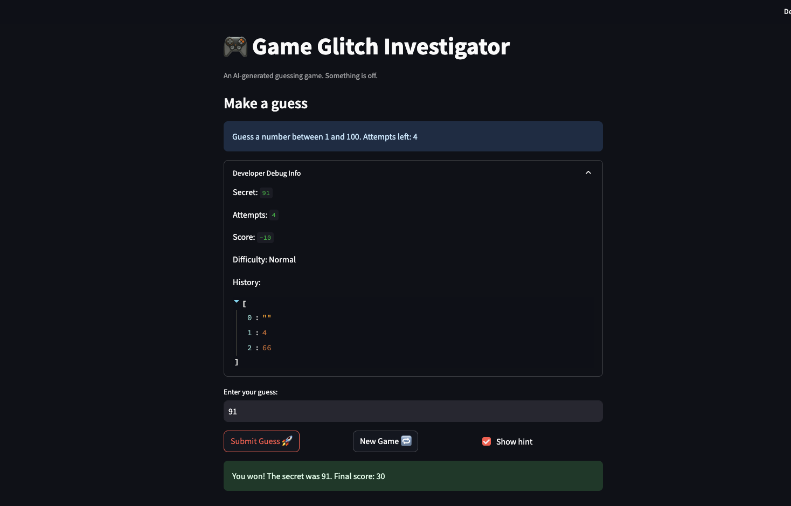

# 🎮 Game Glitch Investigator: The Impossible Guesser

## 🚨 The Situation

You asked an AI to build a simple "Number Guessing Game" using Streamlit.
It wrote the code, ran away, and now the game is unplayable. 

- You can't win.
- The hints lie to you.
- The secret number seems to have commitment issues.

## 🛠️ Setup

1. Install dependencies: `pip install -r requirements.txt`
2. Run the broken app: `python -m streamlit run app.py`

## 🕵️‍♂️ Your Mission

1. **Play the game.** Open the "Developer Debug Info" tab in the app to see the secret number. Try to win.
2. **Find the State Bug.** Why does the secret number change every time you click "Submit"? Ask ChatGPT: *"How do I keep a variable from resetting in Streamlit when I click a button?"*
3. **Fix the Logic.** The hints ("Higher/Lower") are wrong. Fix them.
4. **Refactor & Test.** - Move the logic into `logic_utils.py`.
   - Run `pytest` in your terminal.
   - Keep fixing until all tests pass!

## 📝 Document Your Experience

- [ ] Glitchy Guesser is a number guessing game where the player tries to guess a randomly generated secret number within a limited number of attempts. After each guess the game gives a hint telling you to go higher or lower, and your score is tracked across guesses. The catch is that the game was intentionally shipped with bugs to find and fix.
- [ ] Detail which bugs you found: The hint messages were swapped — 
   - "Go Higher" and "Go Lower" were reversed, so hints always pointed the wrong direction
   - On even-numbered attempts, the secret number was converted to a string, causing alphabetical comparison instead of numerical, which locked the hint to one direction for the entire game regardless of what was guessed
   - After winning, clicking New Game did not restart the game because the win status was never reset
   - The attempt counter was initialized to 1 instead of 0, making it always one ahead of the actual number of guesses

- [ ] Explain what fixes you applied.
   - Moved check_guess to logic_utils.py with corrected integer-only comparison and fixed hint messages
   - Removed the attempts % 2 string conversion block entirely
   - Added st.session_state.status = "playing" to the New Game handler so the game fully resets after a win
   - Changed the attempts initialization from 1 to 0
   - Updated the New Game handler to use random.randint(low, high) so the difficulty range is respected

## 📸 Demo

- [ ] 

## 🚀 Stretch Features

- [ ] [If you choose to complete Challenge 4, insert a screenshot of your Enhanced Game UI here]
